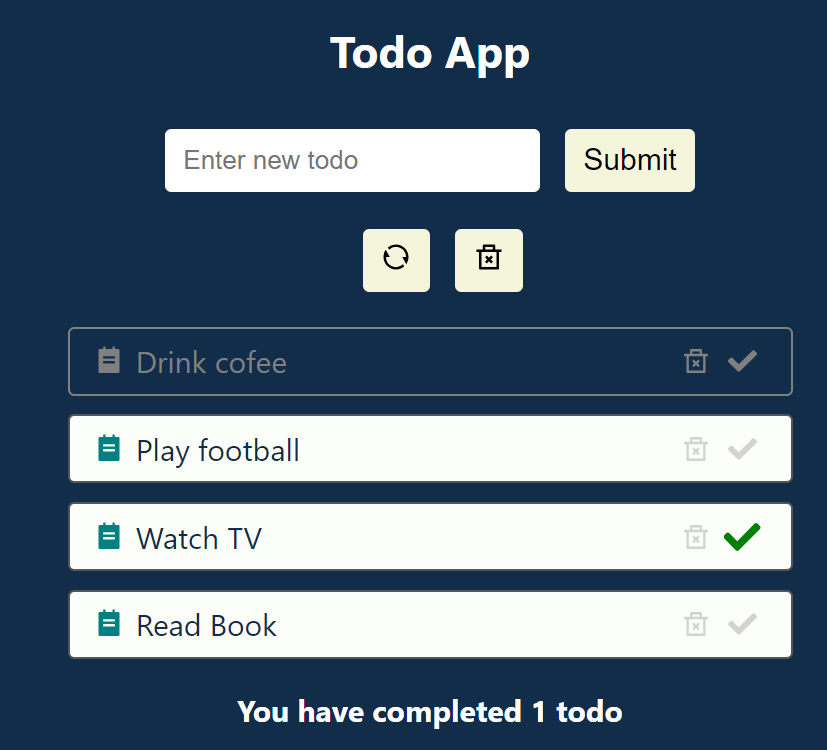

# React Project for the React Course

## Todo-App

### Instalation and run

1.Install packages `npm install`
2.Run `npm start`
3.Open [http://localhost:3000](http://localhost:3000) to view it in your browser.

### Stack

HTML, CSS, JS, React

## Screen

